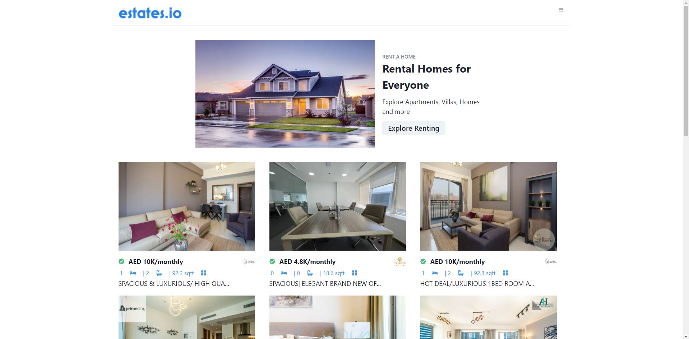

This is a [Next.js](https://nextjs.org/) project.

### The Objective
The goal of this project was to gain a deeper understanding of Nextjs as well as use more advanced hooks in react.

## How it Works

This project uses [Chakra](https://chakra-ui.com/docs/getting-started) for the user interface.

The real estate data is being pulled from an API called Bayut.
([Docs](https://rapidapi.com/apidojo/api/bayut?utm_source=youtube.com%2FJavaScriptMastery&utm_medium=DevRel&utm_campaign=DevRel)) Each property includes data such as price, square ft, beds, bath, and even agency. Along with this other data, each property includes images, which is very important considering the UI is heavily reliant on these images.

## Routing

The app consists of a homepage and a three search pages. The general search page, the for-rent search page, and the for-sale search page.

The file is the same search.js file in all three instances, but the route determines what content the user will be seeing on the page.

When a user searches using specified criteria, the url will change accordingly. This allows the user to copy the url and send to a friend to share the search results.

~~~
https://real-estate-app-five.vercel.app/search?sort=price-asc&areaMax=4000&roomsMin=5
~~~
As you can see, this is the result of a user searching for properties, ordered by lowest price, maximum area of 4000 sq ft, and minimum of 5 bedrooms.

When the user clicks on a property, he is then routed to a corresponding page. This routing uses folder-based routing.

The files are organized as follows. 
~~~
app/pages/
    |__ _app.js
    |__index.js
    |__search.js (searching functionality)
    |__/property/
        |__[id].js (id referring to the id of the selected property)
~~~
Here, you can see the filename of [id].js which allows for the dynamic routing.

Thank you for visiting.

